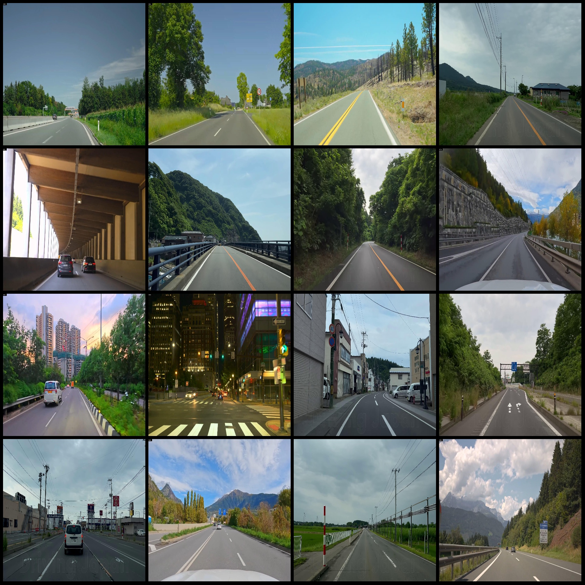
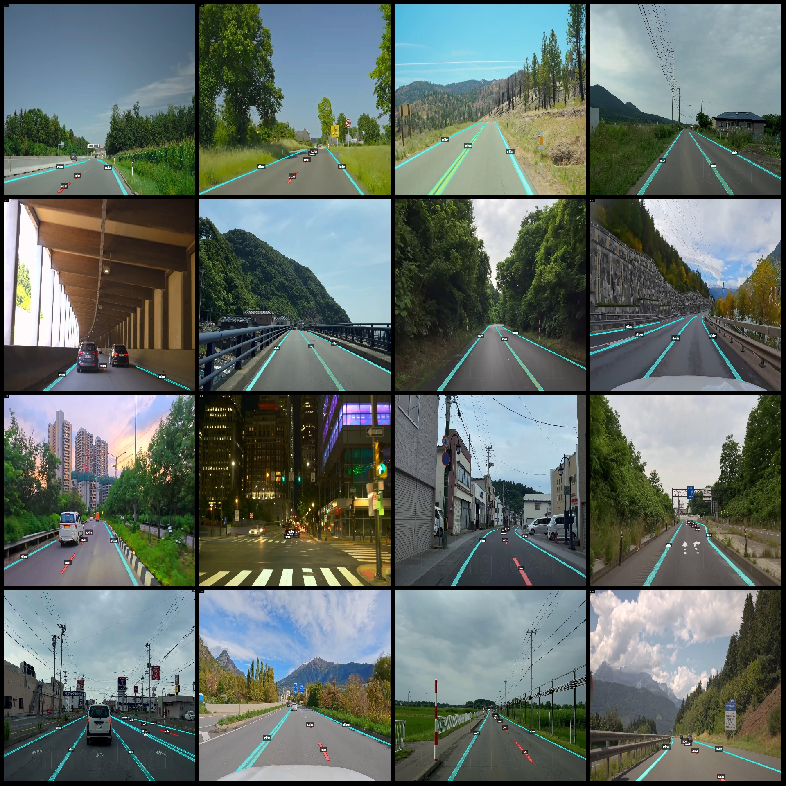
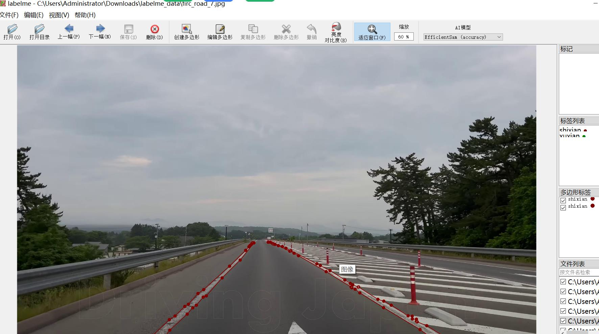

# Autonomous Driving Scenario: Real and Virtual Lane Line Identification and Segmentation Dataset with LabelMe Format, 5467 Images in 2 Categories

Dataset format: LabelMe format (excluding mask files, only containing JPG images and the corresponding JSON files)  
Number of images (JPG file counts): 5467  
Number of annotations (JSON file counts): 5467  
Number of annotating categories: 2  
Annotated category names: ["shixian", "xuxian"]  
Number of boxes for each category:  
shixian (real line lane lines) count = 13945  
xuxian (virtual line lane lines) count = 20117  
Total box count: 34062  
Annotation tools used: labelme v. 5.5.0  
Image resolution: 1920x1080  
Annotation rules: Polygon drawing for categories  
Important note: The dataset can be edited using LabelMe, but the JSON dataset needs to be converted into either a mask or Yolo or COCO format for semantic segmentation or instance segmentation.  
Special declaration: This dataset does not guarantee the accuracy of the trained model or weight files.  
Image previews:  
Annotation examples:  
Randomly selected 16 images:  
Annotation drawing results:  
LabelMe edit image examples:

## Images

Here is a pay link on Stripe ( https://buy.stripe.com/3cs8yP7sY87d0vu9AB ). Please contact me lonlonago@foxmail.com after funding $89, and I will send you a complete data files , thank you!

